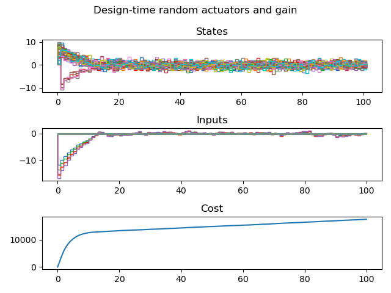
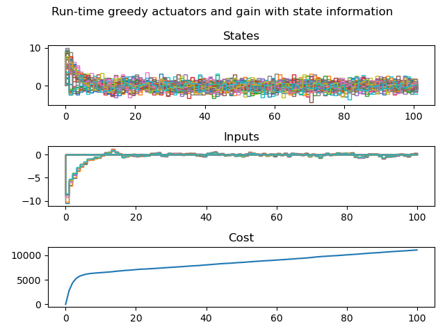

# Self-tuning Network Control Architecture

Code on self-tuning network control architecture.
Optimize the control architecture through greedy selection to minimize control costs.

Self-tuning architecture is based on improving the system model and the information used to select actuators.
Under full-state-feedback for a known system model, this is a run-time selection of actuators based on the current state of the system.

In the broad sense, this problem extends to the observer-based feedback problem where we base the actuator and sensor architecture at the current time step on the current estimated model of the system and work to improve the estimated model of the system over time as we accumulate more trajectory data.

## Organization of files and branches
### main_dev : Test branch for code
### Results 1 : Comparison of design-time random actuator sets to run-time greedy actuator sets
We compare the control costs and performance from run-time greedy actuator selection and full-state feedback with current state information to a random set of design-time actuators and the corresponding fixed full-state feedback.

Dynamics: 50 node randomly generated well-connected ER network (open-loop unstable with eigenvalue magnitude 1.05)

Actuator set subject to cardinality constraint - 5 actuators

Initial state randomly sampled from scaled identity vector

Additive disturbances randomly sampled from zero-mean normal distribution with scaled identity covariance matrix

